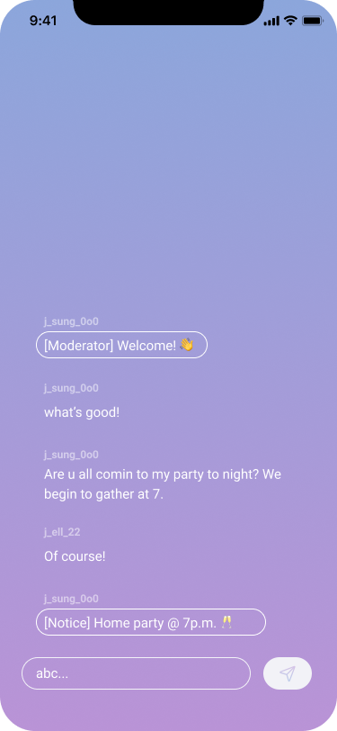

# Sendbird-Chat-in-SwiftUI


## Tips

### How to draw chat UI?
By using `.rotationEffect(Angle(degrees: 180))` twice, you can make message bubbles align to the bottom.

```swift
ScrollView(showsIndicators: false) {
    LazyVStack {
        // Align to the bottom
        Spacer()
                    
        // Draw bubbles
        ForEach(messages) {
            MessageBubble(message: $0)
        }
    }
    .rotationEffect(Angle(degrees: 180))
}
.rotationEffect(Angle(degrees: 180))
```


